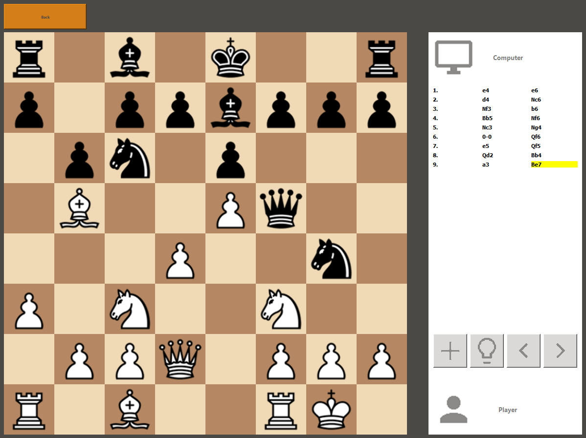

# Chess Move Recommender

A chess application that uses machine learning to recommend optimal moves, built on top of PyQtChess.



## Overview

Chess Move Recommender is an educational project that demonstrates how machine learning techniques can be applied to chess move prediction. The application uses a convolutional neural network (CNN) to evaluate chess positions and recommend the best moves based on a custom search algorithm.

## Features

- Graphical chess interface built with PyQt5
- Machine learning-based move recommendation system
- Game tree search for position evaluation
- Position analysis and visualization
- Save/load functionality for games
- User profiles and statistics tracking

## Project Components

This project consists of two main components:

1. **Chess Engine**:
   - Position representation and legal move generation
   - Custom game tree search algorithm
   - CNN-based position evaluation

2. **User Interface**:
   - Interactive chess board
   - Move recommendation display
   - Game management features

## Technical Approach

### Position Evaluation
The project uses a Convolutional Neural Network (CNN) to evaluate chess positions. The CNN takes a board representation as input and outputs a score indicating the favorability of the position. The board is represented as an 8×8×12 tensor (8×8 board with 12 channels for different piece types), with additional planes for game state information like castling rights and en passant.

### Search Algorithm
A custom minimax search with alpha-beta pruning and iterative deepening explores the game tree to find the most promising moves. The search begins at shallow depths and progressively explores deeper, using the results from previous iterations to optimize move ordering and improve pruning efficiency. The search is guided by the CNN evaluation function.

### Training Data
The model is trained on positions from high-level chess games to learn effective evaluation criteria.

## Installation

### Mac/Linux
```bash
python -m venv .venv
source .venv/bin/activate
pip install wheel
pip install -r requirements.txt
```

### Windows
```bash
python -m venv .venv
.venv\Scripts\activate.bat
pip install wheel
pip install -r requirements.txt
```

After installation, the program can be executed with `python main.py`.

## Dependencies

The project requires the following main libraries:
- PyQt5 for the GUI
- PyTorch for the neural network
- NumPy for numerical operations
- Matplotlib for visualization

See `requirements.txt` for the complete list of dependencies.

## Project Structure

```
chess_move_recommender/
├── main.py                # Application entry point
├── ml/
│   ├── evaluator.py       # ML-based position evaluator
│   ├── features.py        # Feature extraction for ML model
│   ├── model.py           # CNN model definition
│   └── train.py           # Model training script
├── search/
│   └── minimax.py         # Game tree search implementation
├── position.py            # Chess position representation
├── pyqt/                  # GUI components
└── assets/                # Images and resources
```

## Attribution

This project is built upon [PyQtChess](https://github.com/original/pyqtchess), a desktop application that provides a Chess GUI written in PyQt5 along with an integrated chess engine.

### Original Components from PyQtChess:
- Core GUI interface and board representation
- Move validation and chess rules implementation
- Game saving/loading functionality
- User profile management

### New Components in Chess Move Recommender:
- CNN-based position evaluation (replacing the original evaluation system)
- Custom game tree search algorithm (replacing the original search system)
- Machine learning pipeline for chess position analysis
- Enhanced move recommendation visualization

## License

This project is licensed under the MIT License - see the LICENSE file for details.

## Development Status

This project is under active development as part of an academic project on applying artificial intelligence to chess.